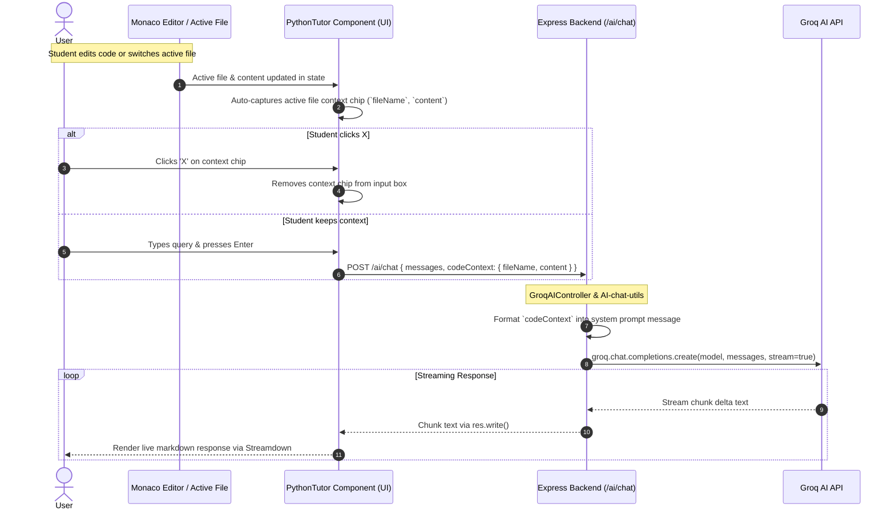

This is a Mermaid diagram explaining how the code context feature works end-to-end:

### Flow Breakdown:
1. **Auto-Capture**: `PythonTutor` automatically tracks the active file and its code in state to render the context chip above the prompt textarea.
2. **User Interaction**: The student can remove the context chip using the `X` button or re-add/refresh it using the `+ Context` button.
3. **Payload Delivery**: When submitting a message, the active `codeContext` payload `{ fileName, content }` is sent along with the chat messages to `POST /ai/chat`.
4. **Backend Processing**: `GroqAIController` passes `codeContext` to `buildContext()`, which wraps the file content in a formatted system prompt block for Groq AI.
5. **Streaming Output**: Groq streams back the response informed by the student's active code context, rendered in real time by Streamdown.