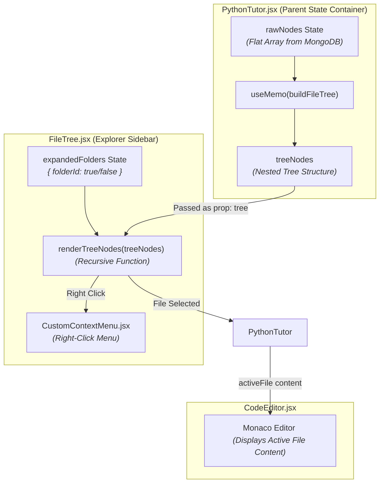
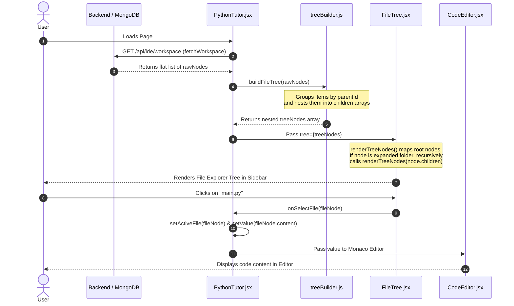

### 1. Component Hierarchy & Data Flow

---

### 2. Step-by-Step Flow: From Database to Screen

---

### Summary of Component Responsibilities

1. **PythonTutor.jsx (Central Coordinator):**
   * Fetches raw flat array data from backend (`rawNodes`).
   * Uses `buildFileTree` wrapped in `useMemo` to construct `treeNodes`.
   * Manages active file state (`activeFile`) and code editor state (`value`).

2. **treeBuilder.js (Helper Utility):**
   * Pure function that maps flat database entries into nested tree nodes with `children: [...]`.
   * Sorts items (folders first, then files alphabetically).

3. **`FileTree.jsx` (Interactive Tree View):**
   * Receives `tree` (`treeNodes`).
   * Manages local UI states like `expandedFolders` (which folders are open/closed) and `contextMenu`.
   * Uses `renderTreeNodes` recursively to display nested items.

4. **`CodeEditor.jsx` (Editor Display):**
   * Renders the active file's source code in the Monaco Editor.